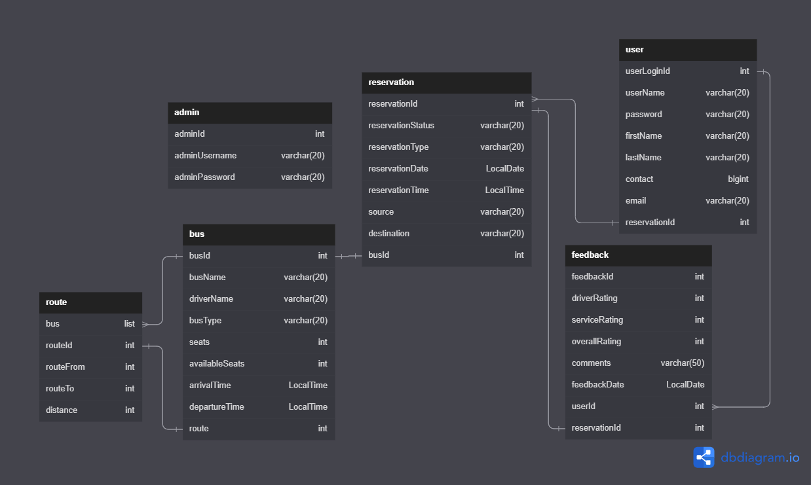

<h1 align="center">BookMyBus</h1>
<h3 align="center">An end-to-end bus reservation system. It handles user authentication, create bus, route, book reservations, provide feedback</h3>
 

## Modules
- Role-based User Authentication
- Route Module
- Bus Module
- Reservation Module
- Feedback Module

<h2 align="left">User Levels</h2>
<h4 align="left">1. Administrator</h4>
<h4 align="left">2. User</h4>
 

<h2 align="left">Tech-stack</h2>
<h4 align="left">

| Techstack|Purpose |
| ------|------ |
| Spring Boot | Build Java based Spring Application |
| MySQL |Relational Database System |
| AWS RDS |Deploy RDBMS System |
| AWS ElasticStalk| Deploy RESTFull web services |
| Swagger|Simplify API Creation |
| Lombok|Annotation based getter, setter, equals, constructor |

</h4>
 

### Deployment

- [Live Project Link](http://busdb-env.eba-3j79v3zc.ap-south-1.elasticbeanstalk.com/swagger-ui/)

<h1 align="left">Screenshots</h1>

  

### Admin Controller

  

### User Controller

  

### Login Controller

  

### Bus Controller

  

### Route Controller

  

### Reservation Controller

  

### Feedback Controller

  

## Authors and Contributors

- [@sumitraghavwork](https://github.com/sumitraghavwork)
- [@suraj9716](https://github.com/suraj9716)
- [@VaibhavBedarkar](https://github.com/VaibhavBedarkar)
- [@SuryAMoharana](https://github.com/SuryAMoharana)
- [@Amit-singh-05](https://github.com/Amit-singh-05)
